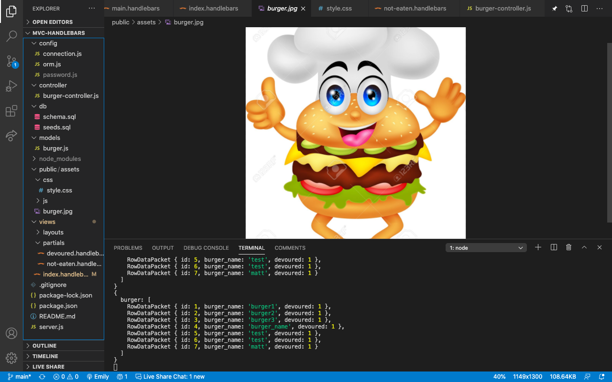

# Welcome to my Yummy Burgers App!

## Description 

I made an api to collect burger data using node

## Installation
Install node.js and run npm install in the package directory

## Usage
Run node . in the package directory

## License
[MIT License](https://opensource.org/licenses/MIT)
